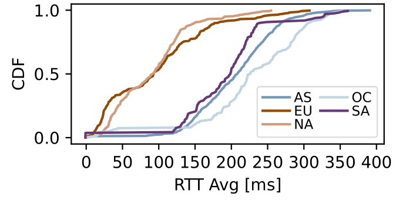
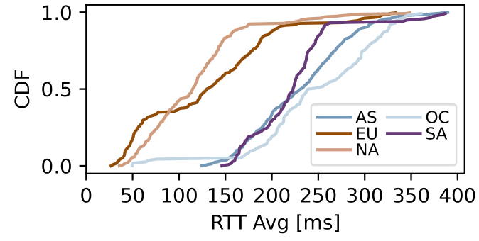
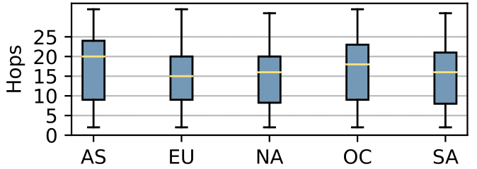
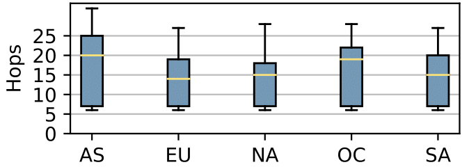

# Starlink vs Hardwired: Measuring connectivity to the cloud

## Measurements Methodology

### Measurement Tool

RIPE Atlas was chosen as the measurement platform. It has several Starlink based probes as well as several hardwired probes that are connected to the platform ready to provide network measurements.

### Targets Selection

Datacenters from the 3 most popular cloud service providers, Amazon, Microsoft, and Google, were chosen as targets all over the world. There are several targets that meet this criteria across various countries. To make things simpler, countries that have all three of these providers operating in them were chosen. Given the initial set of data provided, this resulted in 33 targets situated in 11 countries across 5 regions:

North America: Canada, USA

South America: Brazil

Europe: Germany, United Kingdom

Asia: Hong Kong, India, Japan, Singapore, South Korea

Oceania: Australia

### Probes Selection

RIPE Atlas provides us the ability to filter and view Starlink based probes via its API based on ASNs. Using this API, a total of 65 Starlink based probes(ASN 14593) were fetched - https://atlas.ripe.net/api/v2/probes/?asn=14593. Of these 65, 50 probes were requested for each measurement. These probes were from 13 different countries. A region specific breakdown of these probes can be found below.

As part of the comparative study, an equal number of 50 probes connected to the internet via hardwired connectivity were also requested and a similar 1:1 country specific choice was applied to preserve consistency in measurements.

North America: 26 Probes

Europe: 20 Probes

Oceania: 4 Probes

### Measurements

Each datacenter was targeted by all 100 requested probes. One-off Ping and Traceroute measurements were performed from the probes to the datacenter. Datacenter IP Addresses were resolved prior to running the measurements to reduce latency caused by hostname to IP address lookups.

## Results

Measurements results were fetched using the RIPE Atlas API. Results were then fed into the RIPE Atlas Sagan library which allows us to parse them and derive useful data such as Min RTT, Average RTT, Total Hops, etc.

### Cloud Connectivity: Latency

This section will focus on latency results based on general connectivity to cloud providers across all regions.

#### Figure 1: Hardwired Latency Distribution

#### Figure 2: Starlink Latency Distribution

    
### Cloud Connectivity: Hop-count

This section will focus on hop-count results to cloud providers in all regions.

#### Figure 3: Hardwired hop-counts to cloud datacenters

    
#### Figure 4: Starlink hop-counts to cloud datacenters

    
## Data and Files

All measurement data and results can be found here - https://github.com/krthknrmnch/Starlink_Vs_Hardwired_RIPE_Atlas/tree/one_off

1. ***results*** folder contains all the unfiltered results from RIPE Atlas.

2. ***data*** folder contains relevant extracted data used in generating plots/figures.

RIPE Atlas' Sagan library was used to help extract useful information from the results. The library can be installed with ***pip***:

    pip install ripe.atlas.sagan
